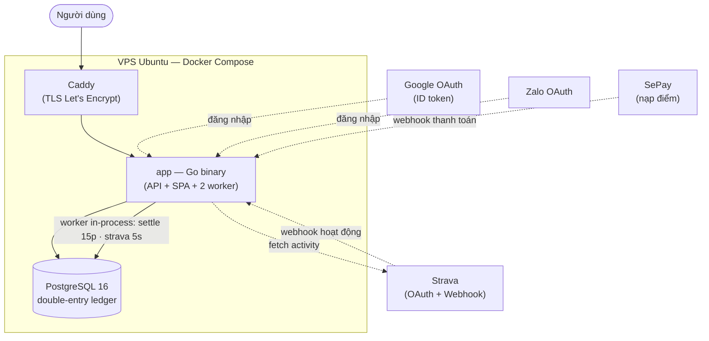
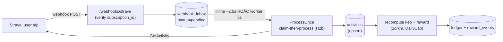

# RO — Kiến trúc hệ thống & Danh sách tính năng

> App "cược điểm tập luyện": thử thách vận động (đi bộ/chạy) cùng bạn bè, đặt cược bằng điểm,
> đồng bộ hoạt động từ Strava, có yếu tố từ thiện và shop đổi quà.
> Prod: **ro.xox.vn** (VPS Ubuntu + Docker + Caddy). Cập nhật: 2026-07-23.

## 1. Kiến trúc tổng quan

- **Frontend**: React 18 + Vite + Tailwind (build-time), SPA do Go binary serve same-origin sau Caddy.
- **Backend**: Go 1.25 binary (`cmd/server`) — API + webhook + **2 background worker** (settlement 15p, strava ingest 5s) chạy in-process, qua docker-compose trên VPS.
- **DB**: PostgreSQL 16 **tự host** (Docker) + pgx/v5, dùng **sổ cái kép (double-entry ledger)** cho mọi biến động điểm.
- **Auth**: Zalo + **Google OAuth native** → JWT HS256 (ký nội bộ bằng `jwtSecret`); quyền admin theo cột `users.is_admin`.
- **Dịch vụ ngoài**: Strava (webhook + OAuth), SePay (nạp điểm), Google (OAuth). TLS + domain do **Caddy** (Let's Encrypt).

## 2. Cấu trúc mã nguồn (Go packages)

| Package | Vai trò |
|---|---|
| `restapi/` | HTTP handlers: auth (zalo, google), challenges, wallet, shop, admin |
| `challenge/` | Logic kèo + `SettlementJob` (giải quyết kèo đến hạn) |
| `ledger/` | Sổ cái kép: `ledger_accounts`, `ledger_entries`, `ledger_transactions` |
| `reward/` | Thưởng check-in + thưởng quãng đường (1 điểm/km tròn, có DailyCap) |
| `ingest/` | Đồng bộ Strava/health: webhook inbox, worker, KMS/cipher mã hoá token |
| `payment/` | Nạp điểm qua SePay |
| `migrations/` | SQL migrations nhúng (`embed.go`) + runner |
| `cmd/server/` | **Entrypoint chính**: binary long-running trên VPS (API + SPA + worker) |
| `web/` | Frontend React |

**Frontend modules** (`web/src/`): `App.jsx` (core) · `activity-feed` · `create-sheet` · `delivery-modal` · `leaderboard-sheet` · `admin-dashboard` · `notification` · `ui-primitives` · `api.js` · `theme.js`.
**5 tab**: Khám phá · Của tôi · Shop · Ví · Tài khoản.

## 3. Mô hình dữ liệu (18 bảng)

| Nhóm | Bảng |
|---|---|
| Người dùng | `users`, `user_integrations` |
| **Sổ cái kép** | `ledger_accounts`, `ledger_entries`, `ledger_transactions`, `account_balances` |
| Kèo | `challenges`, `enrollments`, `enrollment_periods` |
| Hoạt động & thưởng | `activities`, `checkins`, `reward_events`, `reward_daily` |
| Shop | `shop_items`, `point_purchases`, `redemptions` |
| Ingest | `webhook_inbox` (hàng đợi retry — H2b claim-then-process) |
| Hệ thống | `schema_migrations` |

> Điểm là tài sản có giá trị → mọi biến động đi qua sổ cái kép (tài khoản `user_available` / `user_locked`);
> khoá cược = chuyển available→locked, hoàn/giải quyết = `stake_release` locked→available. Không bao giờ DELETE thẳng trên ledger.

## 4. Danh sách tính năng (theo API)

### 🔐 Xác thực
- Đăng nhập **Zalo** OAuth: `POST /v1/auth/zalo` → `POST /v1/auth/zalo/verify`
- Đăng nhập **Google** (native, verify ID token qua JWKS): `POST /v1/auth/google`
- Kết nối **Strava** OAuth: `GET /v1/oauth/strava/callback`
- Quyền admin: cột `users.is_admin` (DB là nguồn quyền lực, kiểm ở middleware)

### 🎯 Kèo (thử thách)
- Xem danh sách kèo, nhóm theo trạng thái mở / đang chạy / kết thúc: `GET /v1/challenges`
- Tạo kèo (đặt tên, bộ môn, mục tiêu, số kỳ, tiền cược) — atomic create+join: `POST /v1/challenges`
- Tham gia kèo, khoá điểm cược: `POST /v1/challenges/{id}/join`
- Bảng xếp hạng từng kèo: `GET /v1/challenges/{id}/leaderboard`
- "Của tôi": `GET /v1/me/challenges`, thống kê `GET /v1/me/stats`

### 🏃 Hoạt động & thưởng
- Đồng bộ Strava tự động (webhook): `POST /webhooks/strava` (verify `GET /webhooks/strava`)
- Đồng bộ health data mobile: `POST /v1/health-sync`
- Hoạt động gần đây: `GET /v1/me/activities`
- **Check-in** thưởng điểm: `POST /v1/checkins`
- Lịch sử điểm thưởng (phân biệt check-in vs tập luyện): `GET /v1/rewards`

### 💰 Ví điểm
- Số dư ví: `GET /v1/wallet` · Lịch sử giao dịch: `GET /v1/wallet/transactions`
- Nạp điểm: `POST /v1/wallet/purchase` → xác nhận qua `POST /webhooks/sepay`

### 🛍️ Shop & từ thiện
- Xem sản phẩm: `GET /v1/shop` · Đổi quà + giao hàng: `POST /v1/redemptions`, `GET /v1/redemptions`
- Quỹ từ thiện: `GET /v1/charities/stats` (kèo có thể quyên góp)

### 🛠️ Quản trị (admin)
- Quản lý user + điều chỉnh điểm: `GET /v1/admin/users`, `POST /v1/admin/users/{id}/adjust`
- CRUD sản phẩm shop: `GET/POST/PUT/DELETE /v1/admin/shop-items`
- Duyệt đơn đổi quà: `GET /v1/admin/redemptions`, `POST /v1/admin/redemptions/{id}/status`

### ⚙️ Nền (worker in-process, không cần cron ngoài)
- **Strava ingest worker** — vòng lặp mỗi 5s, drain `webhook_inbox` (claim-then-process)
- **Settlement worker** — mỗi 15 phút, giải quyết kèo đến hạn (chia thưởng / hoàn cược)

## 5. Luồng đồng bộ Strava

- **Real-time**: webhook xử lý inline ~2.5s. **Lưới an toàn**: worker in-process vòng lặp 5s vét event lỡ cửa sổ (thay Cloudflare Worker cũ).
- Lỗi tạm thời → tự requeue theo backoff (`next_attempt_at`).

## 6. Vận hành & bảo mật

- **Hạ tầng**: VPS Ubuntu (`ro.xox.vn`, IP VN) — Docker Compose (Caddy + app + Postgres 16 tự host). Không còn Vercel/Supabase/Cloudflare. Triển khai: xem `docs/deploy-vps.md`.
- **Đã hardening**: sổ cái kép an toàn (`stake_release`), Google ID token verify `aud`/`iss`/`exp` qua JWKS, gate secret prod + chặn KEK toàn-0, verify `subscription_id` webhook Strava, HTTP timeout + body limit, pgxpool config, graceful drain + panic recover worker, atomic create+join kèo, constant-time SePay key, JWT bắt buộc `exp`, rate-limit `/v1/auth`, admin theo DB (không tin claim), index/pagination/cache-control.
- **Điểm treo bảo mật**: Zalo id-spoofing (fallback tin `id` từ client) — VPS đặt ở VN nên Graph API thường trả `id` authoritative, giảm rủi ro; nên xác nhận qua log.

## 7. Biến môi trường quan trọng (VPS `.env`)

`DATABASE_URL` (nội bộ `@db:5432`), `JWT_SECRET`, `TOKEN_CIPHER_KEY` (base64 32-byte), `SEPAY_API_KEY`/`SEPAY_ACCOUNT_NO`/`SEPAY_BANK_CODE`, `STRAVA_CLIENT_ID`/`STRAVA_CLIENT_SECRET`/`STRAVA_VERIFY_TOKEN`/`STRAVA_SUBSCRIPTION_ID`, `GOOGLE_OAUTH_CLIENT_ID`, `ZALO_APP_ID`/`ZALO_SECRET_KEY`. Mẫu: `env.prod.sample`.

> ⚠️ Prod BẮT BUỘC set `JWT_SECRET`, `TOKEN_CIPHER_KEY`, `SEPAY_API_KEY`, `STRAVA_VERIFY_TOKEN`, `STRAVA_CLIENT_SECRET` — thiếu là app tự thoát.
> ⚠️ Migration chạy tự động qua service `migrate` trong docker-compose (không cần áp tay).
